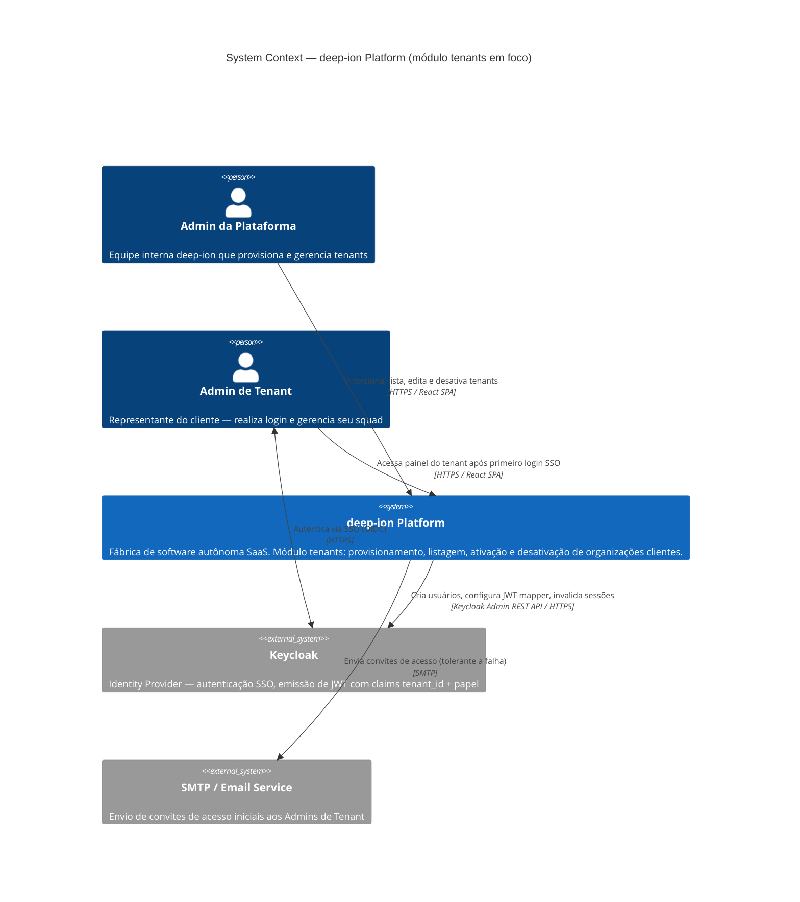
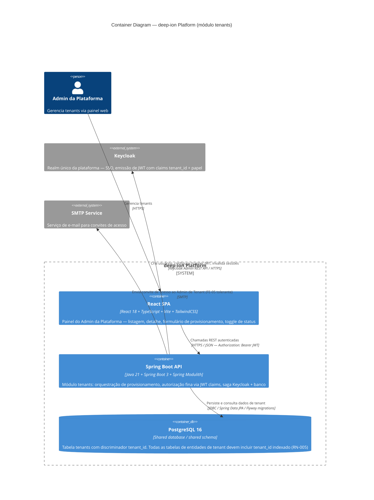
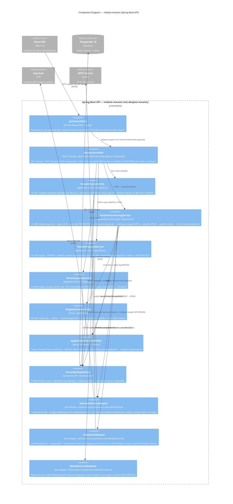

# Plano de Execução — Design e Padrões de Projeto: Módulo `tenants` (UC-001 a UC-005)

**Data:** 2026-03-03  
**Classificação de Impacto Geral:** T2 (UC-002 e UC-003 dominam — integração Keycloak + banco)  
**Blueprint de referência:** `architecture/blueprints/modulith-api-first.yaml`  
**Fonte de requisitos:** `docs/business/tenants/use-cases/` (UC-001..UC-005) + `docs/business/tenants/tenants-regras.md` (RN-001..RN-012)  
**Questões em aberto que BLOQUEIAM implementação:** QA-02 (rollback Keycloak/banco), QA-03 (colisão de slug)

---

## 1. Visão Arquitetural do Módulo

### 1.1 Posicionamento no Spring Modulith

```
net.deepion
├── config/                          ← configuração global (multitenancy, security)
│   └── properties/
├── tenants/                         ← módulo principal
│   ├── api/                         ← interface gerada pelo openapi-generator
│   ├── application/                 ← serviços de aplicação (única camada com lógica)
│   ├── domain/                      ← entidades, value objects, eventos
│   ├── dto/                         ← Request/Response gerados via contrato OpenAPI
│   ├── infrastructure/              ← repositórios JPA, client Keycloak, client e-mail
│   └── TenantModuleConfig.java      ← @Configuration pública do módulo
└── shared/                          ← tipos compartilhados entre módulos (TenantId VO)
```

**Regra de fronteira (Spring Modulith):**
- Apenas classes no pacote raiz `net.deepion.tenants` são acessíveis a outros módulos
- A interface `TenantQueryPort` (para RM-F02, RM-F03 consumirem) é exposta como API pública do módulo
- Comunicação de saída via `ApplicationEventPublisher` — nunca via importação direta de outros módulos

### 1.2 Contratos OpenAPI (API-First)

Seguindo o blueprint `modulith-api-first`, o módulo `tenants` exige:

```
contracts/
└── tenants-api/
    ├── pom.xml                         ← openapi-generator configurado
    └── src/main/resources/openapi/
        └── tenants.yaml                ← contrato único do módulo
```

Endpoints a especificar no contrato:

| Método | Path | UC | Payload |
|---|---|---|---|
| `GET` | `/tenants` | UC-001 | query: `q`, `status`, `page`, `size` |
| `POST` | `/tenants` | UC-002 | `TenantProvisionRequest` |
| `GET` | `/tenants/{tenantId}` | UC-005 | — |
| `PATCH` | `/tenants/{tenantId}` | UC-003, UC-004, UC-005 | `TenantPatchRequest` |

O `PATCH` é polimórfico: backend discrimina pela combinação dos campos presentes (`nome` vs. `status`).

---

### 1.3 Diagramas C4

#### C4 Level 1 — System Context



#### C4 Level 2 — Container



#### C4 Level 3 — Component (Spring Boot API — módulo `tenants`)



---

## 2. Padrões de Projeto por Camada

### 2.1 Camada de Domínio (`domain/`)

**Entidade JPA — `TenantEntity`**

Convenção obrigatória do blueprint:
- Anotação `@Getter @Setter @NoArgsConstructor` — NUNCA `@Data` em entidades JPA
- Sem lógica de negócio dentro da entidade
- `tenant_id` como `@Id` do tipo `String` (ULID armazenado como `VARCHAR(26)`)
- `@Column(updatable = false)` em `tenant_id`, `slug` e `criado_em` — respeita RN-001 e RN-002
- `status` como `@Enumerated(EnumType.STRING)` com enum `TenantStatus { ATIVO, INATIVO }`

```
// Pseudocódigo orientativo (não implementar aqui)
TenantEntity {
  @Id String tenantId          // ULID — @Column(updatable=false)
  String nome                  // máx 100 chars
  String slug                  // máx 50 chars, @Column(updatable=false), @Column(unique=true)
  TenantStatus status          // enum ATIVO/INATIVO
  Instant criadoEm             // @Column(updatable=false)
}
```

**Value Object — `TenantId`**

Definido no pacote `shared/` para reutilização por RM-F02 e RM-F03:
- Wrapper imutável sobre `String` (ULID)
- Geração via `UlidCreator.getUlid().toString()` (biblioteca `com.github.f4b6a3:ulid-creator`)
- Validação de formato no construtor (regex `[0-9A-Z]{26}`)

**Enum de Papéis — `TenantRole`**

```
TenantRole { PO, ARQUITETO, DEV, QA, GATE_KEEPER, ADMIN_TENANT, ADMIN_PLATAFORMA }
```

Localizado em `shared/` — referenciado pelo módulo `tenants` e futuramente por `auth`.

**Evento de Domínio — `TenantProvisionedEvent`**

Publicado após provisionamento bem-sucedido (UC-002). Consumido por:
- RM-F02 (quando implementado): para criar workspace inicial do tenant
- RM-F03 (quando implementado): para registrar o ADMIN_TENANT como primeiro membro

```
TenantProvisionedEvent {
  String tenantId
  String slug
  String adminEmail
  Instant occurredAt
}
```

**Evento de Domínio — `TenantStatusChangedEvent`**

Publicado após UC-003 (desativação) e UC-004 (reativação):
```
TenantStatusChangedEvent {
  String tenantId
  TenantStatus previousStatus
  TenantStatus newStatus
  Instant occurredAt
}
```

### 2.2 Camada de Aplicação (`application/`)

**Padrão: Command / Query Segregation (simplificado)**

Não se usa CQRS completo, mas os serviços são segregados por responsabilidade:

| Classe | Responsabilidade | UCs atendidos |
|---|---|---|
| `TenantQueryService` | Leitura com paginação, busca, detalhe | UC-001, UC-005 (leitura) |
| `TenantProvisioningService` | Orquestra criação atômica banco + Keycloak + e-mail | UC-002 |
| `TenantLifecycleService` | Ações de status (desativação, reativação) | UC-003, UC-004 |
| `TenantUpdateService` | Edição de `nome` | UC-005 (edição) |

Convenção obrigatória do blueprint:
- `@RequiredArgsConstructor` — injeção por construtor, todas as dependências `final`
- Nenhuma anotação JPA nos serviços — apenas ports/interfaces de repositório
- Toda lógica de orquestração aqui, nunca em controllers ou entidades

**Padrão de Rollback para UC-002 — Saga Coreografada (orientação para ADR)**

> ⚠ QA-02 em aberto — o ADR deve definir antes da implementação. Orientação arquitetural:

Sequência recomendada com rollback compensatório:

```
1. Valida slug único no banco         → FE-01 se duplicado
2. Persiste TenantEntity (PENDENTE)   → FE-04 se falhar → abort
3. Cria usuário no Keycloak           → FE-03 se falhar → delete TenantEntity (compensação)
4. Configura mapper JWT no Keycloak   → FE-03 se falhar → delete user Keycloak + delete TenantEntity
5. Atualiza status → ATIVO            → publishes TenantProvisionedEvent
6. Envia e-mail (assíncrono)          → FE-05: mantém tenant criado, sinaliza via flag "convite_pendente"
```

A persistência em dois estados (`PENDENTE` → `ATIVO`) torna o rollback rastreável e idempotente. Adicionar campo `status_provisionamento` na entidade (ver seção de DB).

### 2.3 Camada de Infraestrutura (`infrastructure/`)

**Repositório JPA — `TenantJpaRepository`**

```
TenantJpaRepository extends JpaRepository<TenantEntity, String>
  + Page<TenantEntity> findByFilters(String q, TenantStatus status, Pageable pageable)
  + boolean existsBySlug(String slug)
  + Optional<TenantEntity> findByTenantId(String tenantId)
```

Query derivada + `@Query` onde necessário. Paginação com `Pageable` do Spring Data.

**Port de saída — `KeycloakTenantPort` (interface)**

Define o contrato sem acoplar a implementação Keycloak ao domínio:

```
KeycloakTenantPort {
  void createAdminUser(String tenantId, String email, String firstName, String lastName, TenantRole role)
  void configureJwtMapper(String tenantId)
  void invalidateAllSessions(String tenantId)
  void removeSessionBlock(String tenantId)
  void deleteUser(String email)           // compensação de rollback
}
```

**Implementação — `KeycloakTenantAdapter`**

Usa `org.keycloak:keycloak-admin-client` para operações no Admin REST API do Keycloak:
- Realm único: configurado via `application.yml` (`keycloak.realm`, `keycloak.server-url`, `keycloak.client-id`, `keycloak.client-secret`)
- Mapper de claim: `ProtocolMapperRepresentation` do tipo `oidc-usermodel-attribute-mapper`
- Invalidação de sessões: `DELETE /admin/realms/{realm}/users/{userId}/sessions`
- Bloqueio/desbloqueio: `PUT /admin/realms/{realm}/users/{userId}` com `enabled=false/true`

**Port de saída — `EmailNotificationPort` (interface)**

```
EmailNotificationPort {
  void sendTenantInvite(String email, String tenantName, String loginUrl, String temporaryPassword)
}
```

Implementação inicial pode ser via Spring Mail + template Thymeleaf. Falha deve ser tolerada (FE-05 do UC-002).

**Slug Generator — `SlugGeneratorService`**

Utilitário puro (sem estado, sem dependências de infraestrutura):
```
normalize(String nome): String
  → toLowerCase()
  → replaceAll("[^a-z0-9\\s-]", "")
  → replaceAll("[\\s]+", "-")
  → replaceAll("-{2,}", "-")
  → strip("-")
  → validateNonEmpty()   // garante ao menos 1 char alfanumérico
```

### 2.4 Camada de API (Controllers)

Gerados via OpenAPI contract (`tenants.yaml`) — apenas a interface é gerada.
O controller implementa a interface gerada:

```
TenantController implements TenantsApi {
  @RequiredArgsConstructor
  // injeta: TenantQueryService, TenantProvisioningService, TenantLifecycleService, TenantUpdateService
}
```

**Autorização:** `@PreAuthorize("hasAuthority('ADMIN_PLATAFORMA')")` em todos os endpoints — validação via JWT claim `papel`. Configuração do `SecurityFilterChain` em `config/SecurityConfig.java`.

**Extração de claims:** `TenantContextHolder` (ThreadLocal) populado por `JwtClaimsFilter` antes de cada request — expõe `getCurrentTenantId()` e `getCurrentRole()` para os serviços.

> ⚠ Nota: Para os UCs deste módulo, `ADMIN_PLATAFORMA` opera sobre todos os tenants (não está vinculado a um `tenant_id` específico). O `TenantContextHolder` é relevante para outros módulos (RM-F02, RM-F03) onde usuários operam dentro de seu próprio tenant.

---

## 3. Esquema de Banco de Dados

### 3.1 Tabela principal: `tenants`

```sql
-- Pseudocódigo para Flyway V{N}__create_tenants_table.sql
CREATE TABLE tenants (
    tenant_id          VARCHAR(26)  NOT NULL,          -- ULID
    nome               VARCHAR(100) NOT NULL,
    slug               VARCHAR(50)  NOT NULL,
    status             VARCHAR(10)  NOT NULL,          -- ATIVO | INATIVO
    status_provisioning VARCHAR(20) NOT NULL DEFAULT 'PENDENTE', -- PENDENTE | ATIVO | FALHA
    criado_em          TIMESTAMPTZ  NOT NULL DEFAULT NOW(),
    atualizado_em      TIMESTAMPTZ  NOT NULL DEFAULT NOW(),
    convite_pendente   BOOLEAN      NOT NULL DEFAULT FALSE,

    CONSTRAINT tenants_pkey         PRIMARY KEY (tenant_id),
    CONSTRAINT tenants_slug_unique  UNIQUE      (slug),
    CONSTRAINT tenants_status_check CHECK       (status IN ('ATIVO', 'INATIVO'))
);

CREATE INDEX idx_tenants_status   ON tenants (status);
CREATE INDEX idx_tenants_slug     ON tenants (slug);
CREATE INDEX idx_tenants_criado_em ON tenants (criado_em DESC);
```

**Campos adicionais justificados:**
- `status_provisioning`: suporte ao fluxo saga de UC-002 (PENDENTE → ATIVO | FALHA)
- `atualizado_em`: auditoria básica de última modificação
- `convite_pendente`: sinalização da FE-05 do UC-002 para reenvio manual na tela de detalhe

### 3.2 View calculada: `membros_ativos`

O campo `membros_ativos` é calculado e não armazenado na tabela `tenants`. Será uma view ou query derivada do módulo RM-F03 (fora do escopo deste módulo). Para o MVP:

**Opção A (preferida para MVP):** Query inline no `TenantQueryService`, chamando uma porta de saída `MemberCountPort` que será implementada quando RM-F03 existir. Retorna `0` até o módulo existir.

**Opção B:** View materializada `tenant_member_counts` criada quando RM-F03 for implementado.

> A opção A preserva o isolamento de módulos — MemberCountPort é uma interface em `tenants`, implementada por RM-F03 via evento ou chamada de API pública.

### 3.3 Discriminador `tenant_id` em todas as tabelas (RN-005)

Convenção obrigatória para **todas** as tabelas de entidades de negócio criadas pelo pipeline de outros módulos (RM-F02, RM-F03, etc.):

```sql
-- Template obrigatório para toda tabela de entidade de tenant
ALTER TABLE {nome_tabela} ADD COLUMN tenant_id VARCHAR(26) NOT NULL;
CREATE INDEX idx_{nome_tabela}_tenant_id ON {nome_tabela} (tenant_id);
ALTER TABLE {nome_tabela}
    ADD CONSTRAINT fk_{nome_tabela}_tenant
    FOREIGN KEY (tenant_id) REFERENCES tenants(tenant_id);
```

> ⚠ Esta convenção deve ser verificada pelo DOM-05b (SKILL-QAT-01) em cada PR que crie novas tabelas. R2/A2 no checklist de bloqueio.

---

## 4. Lista de Tarefas de Desenvolvimento

### FASE 0 — Pré-implementação (bloqueantes)

| # | Tarefa | Responsável sugerido | Classificação | Bloqueante para |
|---|---|---|---|---|
| T-00a | Resolver QA-02: definir mecanismo de rollback Keycloak/banco (saga compensatória vs. 2PC) → ADR | Arquiteto | T2 | UC-002, UC-003 |
| T-00b | Resolver QA-03: definir comportamento de colisão de slug → sufixo numérico ou rejeição manual | PO + Arquiteto | T1 | UC-002 |
| T-00c | Definir contrato JWT: nomenclatura exata dos claims `tenant_id` e `papel` → ADR `auth-jwt-claims` | Arquiteto | T2 | UC-002, UC-003, UC-004 |

---

### FASE 1 — Infraestrutura e Contrato (paralelas com Fase 2-DB)

| # | Tarefa | Detalhes |
|---|---|---|
| T-01 | **Criar contrato OpenAPI** `contracts/tenants-api/src/main/resources/openapi/tenants.yaml` | Endpoints: GET /tenants, POST /tenants, GET /tenants/{id}, PATCH /tenants/{id}. Incluir schemas TenantProvisionRequest, TenantPatchRequest, TenantListResponse, TenantDetailResponse, PagedTenantsResponse |
| T-02 | **Configurar pom.xml do módulo contrato** `contracts/tenants-api/pom.xml` | openapi-generator-maven-plugin, apiPackage, modelPackage, interfaceOnly=true, useSpringBoot3=true |
| T-03 | **Configurar pom.xml do módulo core** para depender de `tenants-api` | Adicionar dependência do contrato gerado |

---

### FASE 2 — Banco de Dados / Flyway

| # | Tarefa | Detalhes |
|---|---|---|
| T-04 | **Migration Flyway**: criar tabela `tenants` | `V{N}__create_tenants_table.sql` com todos os campos, constraints e índices definidos na seção 3.1 |
| T-05 | **Migration Flyway**: adicionar `status_provisioning` e `convite_pendente` | Incluir no mesmo V{N} se for a primeira migration, ou separado se iterativo |
| T-06 | **Verificar índice em `tenant_id`** em todas as tabelas existentes que já referenciam tenant | Audit de tabelas existentes — se existirem — para conformidade com RN-005 |

---

### FASE 3 — Domínio e Shared

| # | Tarefa | Detalhes |
|---|---|---|
| T-07 | **`TenantEntity`** em `tenants/domain/` | `@Getter @Setter @NoArgsConstructor`, campos com constraints `@Column(updatable=false)` para `tenantId`, `slug`, `criadoEm`. Status como `@Enumerated(STRING)` |
| T-08 | **`TenantStatus` enum** em `tenants/domain/` | `ATIVO`, `INATIVO` |
| T-09 | **`ProvisioningStatus` enum** em `tenants/domain/` | `PENDENTE`, `ATIVO`, `FALHA` |
| T-10 | **`TenantId` value object** em `shared/` | Wrapper imutável de ULID, validação de formato, factory method `generate()` |
| T-11 | **`TenantRole` enum** em `shared/` | `PO`, `ARQUITETO`, `DEV`, `QA`, `GATE_KEEPER`, `ADMIN_TENANT`, `ADMIN_PLATAFORMA` |
| T-12 | **`TenantProvisionedEvent`** em `tenants/domain/` | `record` com `tenantId`, `slug`, `adminEmail`, `occurredAt` |
| T-13 | **`TenantStatusChangedEvent`** em `tenants/domain/` | `record` com `tenantId`, `previousStatus`, `newStatus`, `occurredAt` |

---

### FASE 4 — Infraestrutura (Adapters)

| # | Tarefa | Detalhes |
|---|---|---|
| T-14 | **`TenantJpaRepository`** em `tenants/infrastructure/` | `JpaRepository<TenantEntity, String>`, método `findByFilters` com `@Query` + `Pageable`, `existsBySlug`, `findByTenantId` |
| T-15 | **`KeycloakTenantPort` interface** em `tenants/infrastructure/` | Definir contrato conforme seção 2.3 |
| T-16 | **`KeycloakTenantAdapter`** implementando `KeycloakTenantPort` | `keycloak-admin-client`, configuração de realm via `@ConfigurationProperties`. Métodos: `createAdminUser`, `configureJwtMapper`, `invalidateAllSessions`, `removeSessionBlock`, `deleteUser` |
| T-17 | **`KeycloakProperties`** em `config/properties/` | `@ConfigurationProperties("keycloak")`, campos: `serverUrl`, `realm`, `clientId`, `clientSecret` |
| T-18 | **`EmailNotificationPort` interface** em `tenants/infrastructure/` | Método `sendTenantInvite` |
| T-19 | **`SmtpEmailAdapter`** implementando `EmailNotificationPort` | Spring Mail + template Thymeleaf. Falha deve ser tolerada (não propagar exceção para UC-002) |
| T-20 | **`SlugGeneratorService`** em `tenants/application/` | Lógica pura de normalização conforme RN-003; método `normalize(String nome): String`; validação de resultado não vazio |
| T-21 | **`MemberCountPort` interface** em `tenants/application/` | `int countActiveMembers(String tenantId)` — implementação dummy retorna 0 até RM-F03 existir |

---

### FASE 5 — Serviços de Aplicação

| # | Tarefa | UC | Detalhes |
|---|---|---|---|
| T-22 | **`TenantQueryService`** | UC-001, UC-005 | Listar com filtros e paginação (20/pág — RN-012); buscar por ID; calcular `membrosAtivos` via `MemberCountPort` |
| T-23 | **`TenantProvisioningService`** | UC-002 | Orquestrar saga: validar slug único → gerar ULID → persistir PENDENTE → criar Keycloak → configurar mapper → atualizar ATIVO → publicar evento → enviar convite (tolerante a falha). Implementar rollback compensatório conforme ADR (T-00a) |
| T-24 | **`TenantLifecycleService`** | UC-003, UC-004 | Desativar: atualizar status → invalidar sessões Keycloak → publicar evento. Reativar: remover bloqueio Keycloak → atualizar status → publicar evento |
| T-25 | **`TenantUpdateService`** | UC-005 | Atualizar `nome` com validação (obrigatório, máx 100 chars) — `slug` imutável (RN-002), nunca aceitar `slug` em PATCH |

---

### FASE 6 — Controller e Segurança

| # | Tarefa | Detalhes |
|---|---|---|
| T-26 | **`TenantController`** implementando `TenantsApi` | `@RestController`, `@RequiredArgsConstructor`. Mapeia chamadas de API para os serviços. `@PreAuthorize("hasAuthority('ADMIN_PLATAFORMA')")` em todos os métodos |
| T-27 | **`JwtClaimsFilter`** em `config/` | `OncePerRequestFilter` que extrai `tenant_id` e `papel` do JWT e popula `TenantContextHolder` (ThreadLocal) |
| T-28 | **`TenantContextHolder`** em `shared/` | ThreadLocal para `tenantId` e `role`; métodos `get`, `set`, `clear` |
| T-29 | **`SecurityConfig`** em `config/` | `SecurityFilterChain` com JWT resource server, registro do `JwtClaimsFilter`, `@EnableMethodSecurity` para `@PreAuthorize` |
| T-30 | **`TenantModuleConfig`** em `tenants/` | `@Configuration` pública do módulo — expõe apenas as interfaces públicas (`TenantQueryService` como bean público para outros módulos consumirem via `TenantQueryPort`) |

---

### FASE 7 — Testes

| # | Tarefa | Tipo | Cobertura |
|---|---|---|---|
| T-31 | **Testes unitários de `SlugGeneratorService`** | Unitário | Normalização, colisão, slug inválido pós-normalização (RN-003, QA-03) |
| T-32 | **Testes unitários de `TenantProvisioningService`** | Unitário (mockado) | Saga caminho feliz, rollback em falha Keycloak, rollback em falha banco, tolerância a falha de e-mail (UC-002 FP + FE-01..FE-05) |
| T-33 | **Testes unitários de `TenantLifecycleService`** | Unitário (mockado) | Desativação + invalidação, falha Keycloak, reativação (UC-003, UC-004) |
| T-34 | **Testes unitários de `TenantUpdateService`** | Unitário | Edição de nome, validação de comprimento, rejeição de edição de slug (UC-005) |
| T-35 | **Testes unitários de `TenantQueryService`** | Unitário (mockado) | Paginação, filtro, busca, empty state (UC-001) |
| T-36 | **Testes de integração: `TenantJpaRepository`** | Integração (Testcontainers PostgreSQL) | CRUD, busca por filtros, paginação, unicidade de slug, índices |
| T-37 | **Testes de integração: `KeycloakTenantAdapter`** | Integração (Testcontainers Keycloak) | Criação de usuário, mapper JWT, invalidação de sessão, rollback |
| T-38 | **Testes de contrato: `TenantController`** | Integração (`@SpringBootTest` + MockMVC) | Todos os endpoints, autenticação JWT, erros 400/401/403/404/500 |
| T-39 | **`ModulithArchitectureTest`** | Arquitetural | Spring Modulith — fronteiras do módulo `tenants`, sem importações cruzadas diretas |
| T-40 | **Cobertura ≥ 80%** | Meta geral | Verificado por SKILL-QAT-00 |

---

### FASE 8 — Frontend (React)

| # | Tarefa | Tela/Componente | UC |
|---|---|---|---|
| T-41 | **Página `/tenants`** — listagem paginada | `TenantsListPage` | UC-001 |
| T-42 | **Componente `TenantTable`** com badge de status e ações por linha | `TenantTable` | UC-001 |
| T-43 | **Componentes de filtro**: busca textual + seletor de status | `TenantFilters` | UC-001 FA-01, FA-02 |
| T-44 | **Estado vazio** com CTA "Provisionar Tenant" | `EmptyState` | UC-001 FA-03 |
| T-45 | **Formulário de provisionamento** com geração de slug em tempo real | `TenantProvisionForm` | UC-002 |
| T-46 | **Campo de telefones dinâmico** (add/remove) | `PhoneFieldArray` | UC-002 FA-02 |
| T-47 | **Modal de confirmação de desativação** com contagem de membros impactados | `DeactivationModal` | UC-003 |
| T-48 | **Página de detalhe `/tenants/:id`** com toggle de status e edição inline de `nome` | `TenantDetailPage` | UC-004, UC-005 |
| T-49 | **Toggle controlado** por estado de status — visual sync com backend | `TenantStatusToggle` | UC-003, UC-004 |
| T-50 | **Hook `useTenants`** — abstração de queries e mutations | `useTenants.ts` | todos |
| T-51 | **Hook `useTenantDetail`** — GET + PATCH + invalidação de cache | `useTenantDetail.ts` | UC-005 |
| T-52 | **Autorização frontend**: ocultar módulo para roles != ADMIN_PLATAFORMA | `ProtectedRoute` | todos |
| T-53 | **Testes unitários frontend** (Vitest + Testing Library) | Componentes críticos | ≥ 80% |

---

## 5. Dependências entre Tarefas

```
T-00a, T-00b, T-00c  (ADRs) ──────────────────── bloqueiam: T-23, T-24, T-29
T-01 (OpenAPI contract) ──────────────────────── bloqueia: T-02, T-03, T-26
T-02, T-03 ──────────────────────────────────── bloqueiam: T-26
T-04, T-05 (Flyway) ─────────────────────────── bloqueiam: T-07, T-36
T-07..T-13 (domínio) ────────────────────────── bloqueiam: T-14..T-25
T-14..T-21 (infra) ──────────────────────────── bloqueiam: T-22..T-25 (serviços)
T-22..T-25 (serviços) ───────────────────────── bloqueiam: T-26 (controller), T-31..T-35 (unit tests)
T-26..T-29 (controller/security) ────────────── bloqueiam: T-38 (integration tests)
T-36, T-37 ──────────────────────────────────── sem bloqueante de fase (paralelo a T-22..T-25)
T-39 (Modulith arch test) ───────────────────── pode rodar a qualquer momento após T-30
```

**Tarefas que podem ser executadas em paralelo:**
- T-01..T-03 (contrato) || T-04..T-06 (banco) || T-41..T-53 (frontend)
- T-07..T-13 (domínio) || T-17 (config Keycloak) || T-18..T-19 (email)
- T-31..T-35 (unit tests) || T-36..T-37 (integration tests infra)

---

## 6. Riscos e Condições de Bloqueio

| Risk ID | Risco | Impacto | Mitigação |
|---|---|---|---|
| R1 | QA-02 não resolvido antes de T-23: implementação de rollback sem ADR gera retrabalho | Alto | T-00a deve preceder UC-002 — BLOQUEANTE |
| R2 | QA-03 sem resolução: FE-01 do UC-002 incompleto em produção | Médio | Implementar rejeição com edição manual como comportamento padrão até ADR aprovar sufixo |
| R3 | `tenant_id` ausente no JWT Keycloak: toda autorização do backend falha silenciosamente | Crítico | T-37 (teste Keycloak) deve validar claims antes do PR ser aprovado — bloqueante por RN-001/RN-004 |
| R4 | Fronteira de módulo violada: outro módulo importando `TenantEntity` diretamente | Alto | T-39 (ModulithArchitectureTest) é gate de CI obrigatório |
| R5 | `slug` editável após persistência: viola RN-002 | Alto | `@Column(updatable=false)` na entidade + validação no `TenantUpdateService` (rejeitar PATCH com campo `slug`) |
| R6 | Tabelas de RM-F02/F03 sem `tenant_id` indexado | Crítico | DOM-05b SKILL-QAT-01 deve verificar RN-005 em cada PR — bloqueante universal |

---

## 7. Gates Necessários

| Gate | Descrição | Condição |
|---|---|---|
| Gate T-00 | ADRs de rollback (QA-02), slug (QA-03) e JWT claims (T-00c) aprovados pelo Tech Lead | **Pré-requisito** para UC-002 e UC-003 |
| Gate 1 | Contrato OpenAPI `tenants.yaml` revisado pelo Tech Lead antes da geração | Antes de T-02 |
| Gate 2 | Migration Flyway revisada pelo DBA/Tech Lead antes de aplicar em staging | Antes de T-04 rodar em ambientes não-local |
| Gate 3 | PR da Fase 3+4+5 aprovado com `ModulithArchitectureTest` passando | Antes de merge |
| Gate 4 | Cobertura ≥ 80% verificada pelo DOM-05b | Antes de Gate 4 do pipeline |
| Gate 5 | Homologação funcional com Keycloak real em ambiente staging | UC-002 + UC-003 mandatórios |

---

## 8. Tabela de Tarefas — Visão para DOM-04

| # | Tarefa | Agente | Depende de | Paralelo com | Modelo sugerido | Justificativa |
|---|---|---|---|---|---|---|
| T-00a | ADR rollback UC-002 | DOM-03 | — | T-00b, T-00c | Claude Opus 4.6 | Raciocínio arquitetural multi-etapa (saga vs. 2PC) |
| T-00b | Decisão QA-03 slug colisão | DOM-03 | — | T-00a, T-00c | GPT-4o | Análise de impacto pontual, decisão negocial simples |
| T-00c | ADR JWT claims contract | DOM-03 | — | T-00a, T-00b | Claude Opus 4.6 | Impacto de segurança transversal |
| T-01 | Contrato OpenAPI tenants.yaml | DOM-04 | T-00c | T-04 | GPT-5.1-Codex | Geração de YAML estruturado, multi-endpoint |
| T-02..T-03 | pom.xml contrato + core | DOM-04 | T-01 | T-04..T-06 | GPT-4o | Configuração de build, tarefa simples |
| T-04..T-06 | Migrations Flyway | DOM-04 | — | T-01..T-03 | GPT-4o | SQL simples com checklist de índices |
| T-07..T-13 | Entidade, enums, VOs, eventos | DOM-04 | T-04 | T-17..T-19 | GPT-5.1-Codex | Geração de código Java, múltiplos arquivos |
| T-14..T-21 | Repositório, ports, adapters | DOM-04 | T-07..T-13 | T-31..T-35 | GPT-5.1-Codex | Integração Keycloak + JPA, código complexo |
| T-22..T-25 | Serviços de aplicação | DOM-04 | T-14..T-21, T-00a | — | GPT-5.1-Codex | Lógica de saga + orquestração |
| T-26..T-30 | Controller + segurança | DOM-04 | T-22..T-25 | T-36..T-37 | GPT-5.1-Codex | JWT filter + Spring Security config |
| T-31..T-38 | Testes (unit + integração) | DOM-04 | T-22..T-30 | T-41..T-53 | GPT-5.1-Codex | Testcontainers + MockMVC — código complexo |
| T-39..T-40 | Modulith arch test + cobertura | DOM-05b | T-31..T-38 | — | GPT-4o | Verificação, não geração |
| T-41..T-53 | Frontend React | DOM-04 (fe) | T-01 (tipos gerados) | T-07..T-38 | GPT-5.1-Codex | Múltiplos componentes + hooks |
