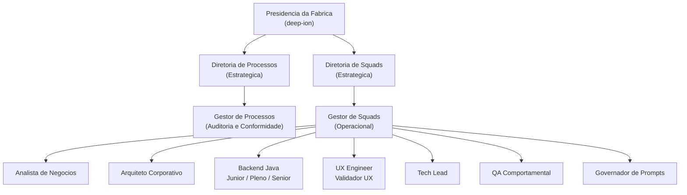

# Organograma Oficial — Fábrica de Software Autônoma deep-ion
**Data de referência:** 07/03/2026 · **Versão:** 1.0

---

## Estrutura Hierárquica

---

## Quadro de Agentes por Nível

| Agente / Papel | Nível | Tipo | Reporte |
|----------------|-------|------|---------|
| Presidente da Fábrica | Presidência | Universal | — |
| Diretor de Processos | Diretoria | Universal | Presidência |
| Diretor de Squads | Diretoria | Universal | Presidência |
| Gestor de Processos | Gestão | Universal | Diretoria de Processos |
| Gestor de Squads | Gestão | Universal | Diretoria de Squads |
| Governador de Prompts | Especialista | Universal | Diretoria de Squads |
| Analista de Negócios | Operacional | Especialista de Projeto | Gestor de Squads |
| Arquiteto Corporativo | Operacional | Especialista de Projeto | Gestor de Squads |
| Backend Java Júnior | Operacional | Especialista de Projeto | Gestor de Squads |
| Backend Java Pleno | Operacional | Especialista de Projeto | Gestor de Squads |
| Backend Java Sênior | Operacional | Especialista de Projeto | Gestor de Squads |
| UX Engineer | Operacional | Especialista de Projeto | Gestor de Squads |
| Validador UX | Operacional | Especialista de Projeto | Gestor de Squads |
| QA Comportamental | Operacional | Especialista de Projeto | Gestor de Squads |
| Tech Lead | Operacional | Especialista de Projeto | Gestor de Squads |

**Total de agentes:** 15 (2 Diretores + 1 Gestor + 1 Especialista + 9 Operacionais + Presidência)

---

## Lacunas de Cobertura Diretiva

| # | Domínio Estratégico Descoberto | Diretoria Necessária | Prioridade | Diagnóstico de Referência |
|---|-------------------------------|----------------------|------------|--------------------------|
| L-01 | Stack tecnológica, plataforma, CI/CD, LLMs | Diretoria de Tecnologia e Plataforma | **Alta** | DIAG-20260306-001 (G-01, G-07) |
| L-02 | Qualidade sistêmica, confiabilidade, golden tests, output schema | Diretoria de Qualidade e Confiabilidade | **Alta** | DIAG-20260306-001 (G-03, G-08) |
| L-03 | Portfólio, produto, roadmap, SLA de entrega, **sizing de escopo, modelo de cobrança e relacionamento comercial** | Diretoria de Produto, Entrega e Comercial | **Alta** | DIAG-20260306-001 (G-11) · MANDATO-20260307-002 |
| L-04 | Segurança, governança de IA, LGPD, auditoria de modelos | Diretoria de Segurança e Governança de IA | **Crítica** | DIAG-20260306-001 (G-01), DIAG-20260307-001 (GAP-2) |

---

## Nota Executiva

A fábrica opera com **base diretiva funcional** nas dimensões de Processos e Squads. As quatro lacunas identificadas acima não são gaps operacionais — são **ausências de mandato estratégico** em domínios que afetam diretamente a segurança, a qualidade e a capacidade de escala da fábrica.

A lacuna **L-03** teve seu escopo **expandido** por deliberação presidencial (MANDATO-20260307-002): a Diretoria correspondente passa a denominar-se **Diretoria de Produto, Entrega e Comercial**, absorvendo explicitamente o mandato de sizing de escopo, modelo de precificação (APF como métrica primária), cobrança por entrega e relacionamento comercial com clientes externos.

A Presidência submeterá Propostas de Nova Diretoria para deliberação em ciclo estratégico subsequente.

---

*Artefato emitido pela Presidência da Fábrica — deep-ion · 07/03/2026*  
*Insumos: DIAG-20260306-001, DIAG-20260306-003, DIAG-20260307-001*
