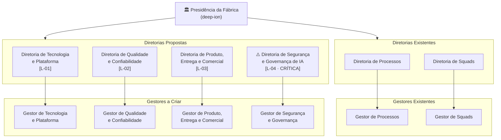

# Organograma Proposto — Estado-Alvo
## Fábrica de Software Autônoma deep-ion

**Data de referência:** 07/03/2026 · **Versão:** 1.0  
**Status:** PROPOSTO — sujeito a deliberação presidencial após entrega das Propostas de Nova Diretoria

> Este documento representa o **estado-alvo** da estrutura organizacional da fábrica após a criação das quatro Diretorias identificadas como lacunas no ORGANOGRAMA-20260307 e formalizadas pelos mandatos MANDATO-20260307-001 e MANDATO-20260307-002.  
> O **estado atual** encontra-se em [ORGANOGRAMA-20260307.md](ORGANOGRAMA-20260307.md).

---

## Estrutura Hierárquica Proposta

---

## Quadro de Diretorias — Estado-Alvo

| Diretoria | Domínio Estratégico | Status | Reporte |
|-----------|---------------------|--------|---------|
| Diretoria de Processos | Evolução e governança de processos | **Existente** | Presidência |
| Diretoria de Squads | Composição e governança das squads | **Existente** | Presidência |
| Diretoria de Tecnologia e Plataforma | Stack tecnológica, plataforma, CI/CD, LLMs | **A CRIAR — L-01** | Presidência |
| Diretoria de Qualidade e Confiabilidade | Qualidade sistêmica, confiabilidade, output contracts | **A CRIAR — L-02** | Presidência |
| Diretoria de Produto, Entrega e Comercial | Portfólio, sizing APF, precificação, relacionamento comercial | **A CRIAR — L-03** | Presidência |
| ⚠️ Diretoria de Segurança e Governança de IA | Segurança, LGPD, governança de IA, auditoria de modelos | **A CRIAR — L-04 · CRÍTICA** | Presidência |

> O detalhamento de cada Diretoria — incluindo gestores, especialistas e agentes operacionais — é responsabilidade das respectivas visões diretivas e não integra este documento.

---

## Plano de Criação das Novas Diretorias

Conforme MANDATO-20260307-001, a criação das novas Diretorias segue sequência formal de 4 fases:

| Fase | Ação | Responsável | Status |
|------|------|-------------|--------|
| **Fase 1** | Criar agentes e SKILLs P1 (Context Engineer, Risk Arbiter, Python AI Engineer, SKILL-context-engineering) | Diretor de Squads | Pendente |
| **Fase 2** | Elaborar 4 Propostas Formais de Nova Diretoria (`PROPOSTA-DIR-*.md`) na ordem: L-04 → L-01 → L-02 → L-03 | Diretor de Squads | Pendente |
| **Fase 3** | Deliberar e emitir criação oficial de cada Diretoria | Presidência + Diretores | Aguardando Fase 2 |
| **Fase 4** | Realocar agentes aos novos mandatos (ex: Risk Arbiter → L-04, Context Engineer → L-01) | Diretor de Squads | Aguardando Fase 3 |

---

## Prioridade de Criação das Diretorias

| Prioridade | Diretoria | Lacuna | Justificativa |
|-----------|-----------|--------|---------------|
| 🔴 1ª | Diretoria de Segurança e Governança de IA | L-04 | **Crítica** — ausência de governança de IA expõe toda a fábrica a riscos de segurança, LGPD e auditoria de modelos |
| 🟠 2ª | Diretoria de Tecnologia e Plataforma | L-01 | **Alta** — sem mandato sobre stack e LLMs, não há autoridade para decisões sobre a espinha dorsal tecnológica |
| 🟠 3ª | Diretoria de Qualidade e Confiabilidade | L-02 | **Alta** — GAPs G-03 (output schema) e G-08 (golden tests) afetam confiabilidade de todos os agentes |
| 🟠 4ª | Diretoria de Produto, Entrega e Comercial | L-03 | **Alta** — necessária para viabilizar o modelo de cobrança APF e o relacionamento comercial com clientes externos |

---

## Nota Executiva

Este organograma proposto consolida a visão estratégica de longo prazo da fábrica `deep-ion`, derivada integralmente dos diagnósticos e mandatos emitidos em 07/03/2026. A transição do estado atual para o estado-alvo é sequenciada para preservar a capacidade de entrega contínua: agentes P1 são criados antes das Diretorias, garantindo que a fábrica não paralise enquanto a estrutura evolui.

A Diretoria de Produto, Entrega e Comercial incorpora o mandato expandido de sizing e precificação por Análise de Pontos de Função (APF/IFPUG), conforme posicionamento estratégico da Presidência no MANDATO-20260307-002, tornando a fábrica apta a operar com contratos orientados a escopo funcional auditável.

A estrutura proposta eleva a fábrica de uma organização com **2 eixos diretivos** para uma com **6 eixos diretivos**, cobrindo integralmente os domínios de Processos, Squads, Tecnologia, Qualidade, Produto/Comercial e Segurança/Governança de IA.

---

*Artefato emitido pela Presidência da Fábrica — deep-ion · 07/03/2026*  
*Insumos: ORGANOGRAMA-20260307, MANDATO-20260307-001, MANDATO-20260307-002*
