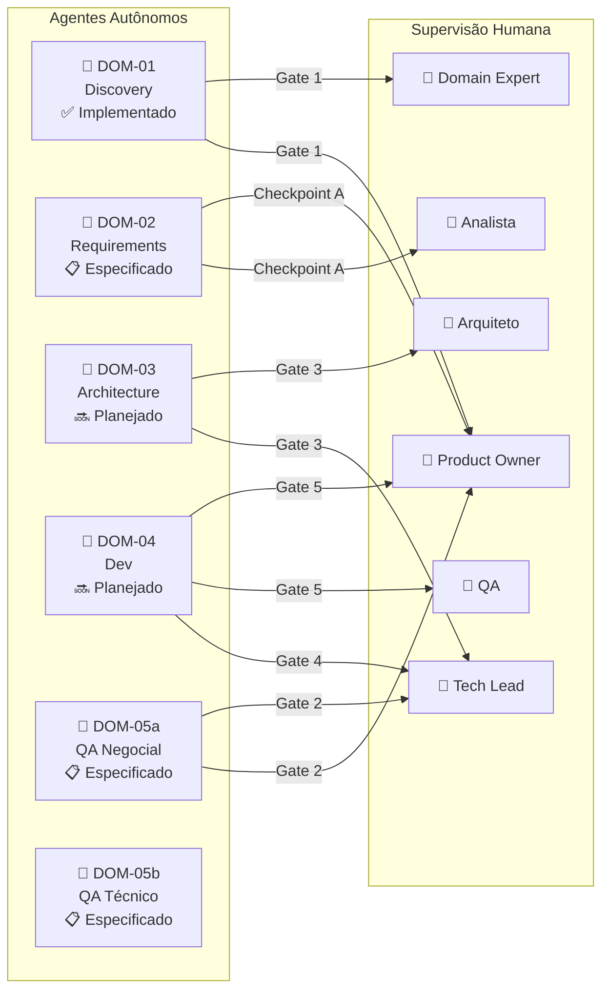
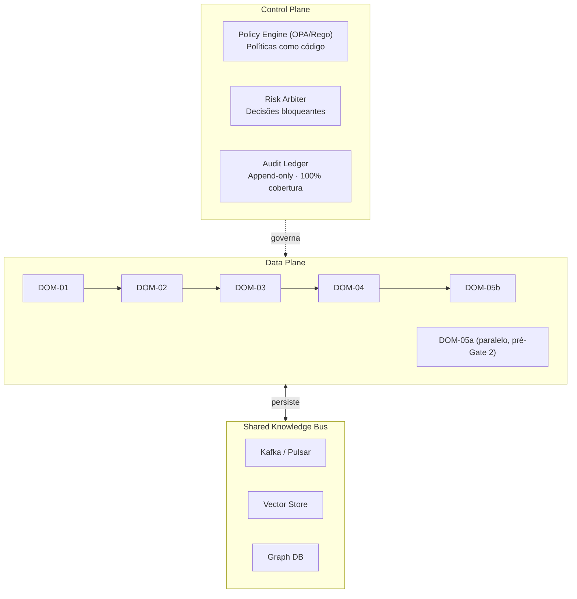

# PROC-000 — Visão Geral da Fábrica de Software Autônoma

## Metadados

| Campo | Valor |
|-------|-------|
| **ID** | PROC-000 |
| **Versão** | 1.0 |
| **Última atualização** | 2026-03-06 |
| **Responsável** | Gestor de Processos |
| **Escopo** | Fábrica inteira (`deep-ion`) |

---

## 1. Objetivo

Este documento descreve a estrutura operacional da **Fábrica de Software Autônoma `deep-ion`**: uma fábrica onde agentes de IA (DOM-01..DOM-05b) executam etapas do ciclo de desenvolvimento sob supervisão humana, com gates de controle que garantem rastreabilidade, conformidade regulatória e qualidade.

O modelo combina **automação máxima** (para demandas de baixo risco) com **supervisão humana obrigatória** (para demandas de alto impacto), classificando cada demanda em **T0..T3** com base em critérios objetivos de risco.

---

## 2. Pipeline Completo

```mermaid
flowchart TD
    START([📋 Issue GitHub]) --> DOM01

    subgraph DISCOVERY["🔍 Discovery (PROC-001)"]
        DOM01["DOM-01\nDiscovery Agent"]
        DOM01 --> DR["DecisionRecord\nClassificação T0..T3"]
        DR --> LBL1["Label: gate/1-aguardando"]
    end

    LBL1 --> G1{{"🔒 Gate 1\nPO / Domain Expert"}}
    G1 -->|"/gate1-reject"| REJ1(["❌ Demanda Rejeitada"])
    G1 -->|"/gate1-approve"| DOM02

    subgraph REQUIREMENTS["📝 Requisitos (PROC-002)"]
        DOM02["DOM-02\nRequirements Agent"]
        DOM02 --> REQ00["SKILL-REQ-00\nDetector de Conflitos"]
        REQ00 --> REQ01["SKILL-REQ-01\nBusiness Analyst → BAR"]
        REQ01 --> CKA{{"🔒 Checkpoint A\nAnalista / PO"}}
        CKA -->|"/ba-approve"| REQ02["SKILL-REQ-02\nUse Case Modeler → UCs + Matriz"]
        REQ02 --> LBL2["Label: gate/2-aguardando"]
    end

    subgraph QANEG["🧪 QA Negocial (PROC-003)"]
        LBL2 --> DOM05A["DOM-05a\nQA Negocial Agent"]
        DOM05A --> QAN00["SKILL-QAN-00\nCompletude de Artefatos"]
        QAN00 --> QAN01["SKILL-QAN-01\nConsistência Negocial"]
        QAN01 --> QAN02["SKILL-QAN-02\nGeração de TestPlan"]
    end

    QAN02 --> G2{{"🔒 Gate 2\nPO + Tech Lead"}}
    G2 -->|"/gate2-reject"| REJ2(["❌ Volta ao DOM-02"])
    G2 -->|"/gate2-approve"| DOM03

    subgraph ARCH["🏛️ Arquitetura (PROC-004)"]
        DOM03["DOM-03\nArchitecture Agent"]
        DOM03 --> ADR["ADR + Esqueleto\nde Código"]
    end

    ADR --> G3{{"🔒 Gate 3\nTech Lead + Arquiteto"}}
    G3 -->|"/gate3-reject"| REJ3(["❌ Volta ao DOM-03"])
    G3 -->|"/gate3-approve"| DOM04

    subgraph DEV["💻 Implementação (PROC-005)"]
        DOM04["DOM-04\nDev Agent"]
        DOM04 --> PR["Pull Request\nCódigo + Testes"]
    end

    subgraph QATECH["🔬 QA Técnico (PROC-006)"]
        PR --> DOM05B["DOM-05b\nQA Técnico Agent"]
        DOM05B --> QAT00["SKILL-QAT-00\nCobertura de Testes"]
        QAT00 --> QAT01["SKILL-QAT-01\nCompliance Arquitetural"]
        QAT01 --> QAT02["SKILL-QAT-02\nAuditoria de RNs"]
    end

    QAT02 --> G4{{"🔒 Gate 4\nTech Lead"}}
    G4 -->|"/gate4-reject"| REJ4(["❌ REQUEST_CHANGES\nVolta ao DOM-04"])
    G4 -->|"/gate4-approve"| G5{{"🔒 Gate 5\nQA + PO\nHomologação"}}
    G5 -->|"Reprovado"| REJ5(["❌ Volta para correção"])
    G5 -->|"Aprovado"| PROD(["✅ Produção"])

    style DISCOVERY fill:#e3f2fd,stroke:#1565c0
    style REQUIREMENTS fill:#e8f5e9,stroke:#2e7d32
    style QANEG fill:#fff3e0,stroke:#e65100
    style ARCH fill:#f3e5f5,stroke:#6a1b9a
    style DEV fill:#e0f7fa,stroke:#006064
    style QATECH fill:#fce4ec,stroke:#880e4f
    style G1 fill:#fff9c4,stroke:#f57f17
    style G2 fill:#fff9c4,stroke:#f57f17
    style G3 fill:#fff9c4,stroke:#f57f17
    style G4 fill:#fff9c4,stroke:#f57f17
    style G5 fill:#fff9c4,stroke:#f57f17
    style CKA fill:#fff9c4,stroke:#f57f17
    style PROD fill:#c8e6c9,stroke:#1b5e20
```

---

## 3. Agentes da Fábrica

---

## 4. Modelo de Classificação de Risco (T0→T3)

| Classe | Score | Autonomia | Pipeline |
|--------|-------|-----------|----------|
| **T0** | 1.0–2.5 | Totalmente autônomo | Implementa → staging → aprovação funcional → prod |
| **T1** | 2.6–4.5 | Semi-autônomo | Gates: QA Review + Validação funcional |
| **T2** | 4.6–6.5 | Multi-gate | 5 gates obrigatórios |
| **T3** | 6.6–9.0 | Totalmente assistido | Zero autonomia — agentes como aceleradores |

> Ver [PROC-007 — Modelo de Classificação](PROC-007_modelo-classificacao.md) para detalhes completos.

---

## 5. Artefatos Obrigatórios por Classe

| Artefato | T0 | T1 | T2 | T3 |
|----------|:--:|:--:|:--:|:--:|
| DecisionRecord | ✅ | ✅ | ✅ | ✅ |
| Gate 1 (PO) | — | ✅ | ✅ | ✅ |
| BAR | — | ✅ | ✅ | ✅ |
| Use Cases (Gherkin) | — | ✅ | ✅ | ✅ |
| TestPlan | — | ✅ | ✅ | ✅ |
| Gate 2 (PO + TL) | — | — | ✅ | ✅ |
| Matriz de Rastreabilidade | — | — | ✅ | ✅ |
| ADR | — | — | ✅ | ✅ |
| Gate 3 (TL + Arq.) | — | — | ✅ | ✅ |
| Gate 4 (TL) | — | ✅ | ✅ | ✅ |
| Gate 5 (QA + PO) | — | — | ✅ | ✅ |

---

## 6. Princípios Operacionais

1. **Evidência sobre opinião** — toda decisão se baseia em artefatos verificáveis registrados no Audit Ledger.
2. **Ambiguidade explicitada** — nenhum agente resolve silenciosamente uma dúvida crítica; ambiguidades bloqueiam.
3. **Canal único** — comunicação entre skills ocorre via comentários estruturados na Issue (ou PR Review).
4. **Audit Ledger 100%** — toda decisão gera `DecisionRecord` append-only com cobertura total.
5. **Segregação de responsabilidades** — nenhum agente atua em gate que não é seu.
6. **LGPD obrigatório** — qualquer envolvimento de dados pessoais força aprovação humana em qualquer classe T.

---

## 7. Arquitetura de Controle

---

## 8. Escalada Automática

| Condição | Ação automática |
|----------|----------------|
| `confidence_score < 0.65` | Escalar para Risk Arbiter |
| `risk_level == CRITICAL` | Bloquear + escalar para humano |
| `reversibility == IRREVERSIBLE AND risk_level == HIGH` | Escalar para humano |
| Dado pessoal (LGPD) | Aprovação humana obrigatória |

---

## 9. Referências

| Documento | Localização |
|-----------|-------------|
| Pipeline detalhado | [SKILL-pipeline.md](../../../architecture/skills/SKILL-pipeline.md) |
| Agentes DOM-01..DOM-05b | [SKILL-agentes.md](../../../architecture/skills/SKILL-agentes.md) |
| Modelo de classificação | [SKILL-modelo-classificacao.md](../../../architecture/skills/SKILL-modelo-classificacao.md) |
| Responsabilidades RACI | [SKILL-responsabilidades.md](../../../architecture/skills/SKILL-responsabilidades.md) |
| Regras negociais | [SKILL-regras-negociais.md](../../../architecture/skills/SKILL-regras-negociais.md) |
| Processos individuais | [SKILL-processos.md](../../../architecture/skills/SKILL-processos.md) |
