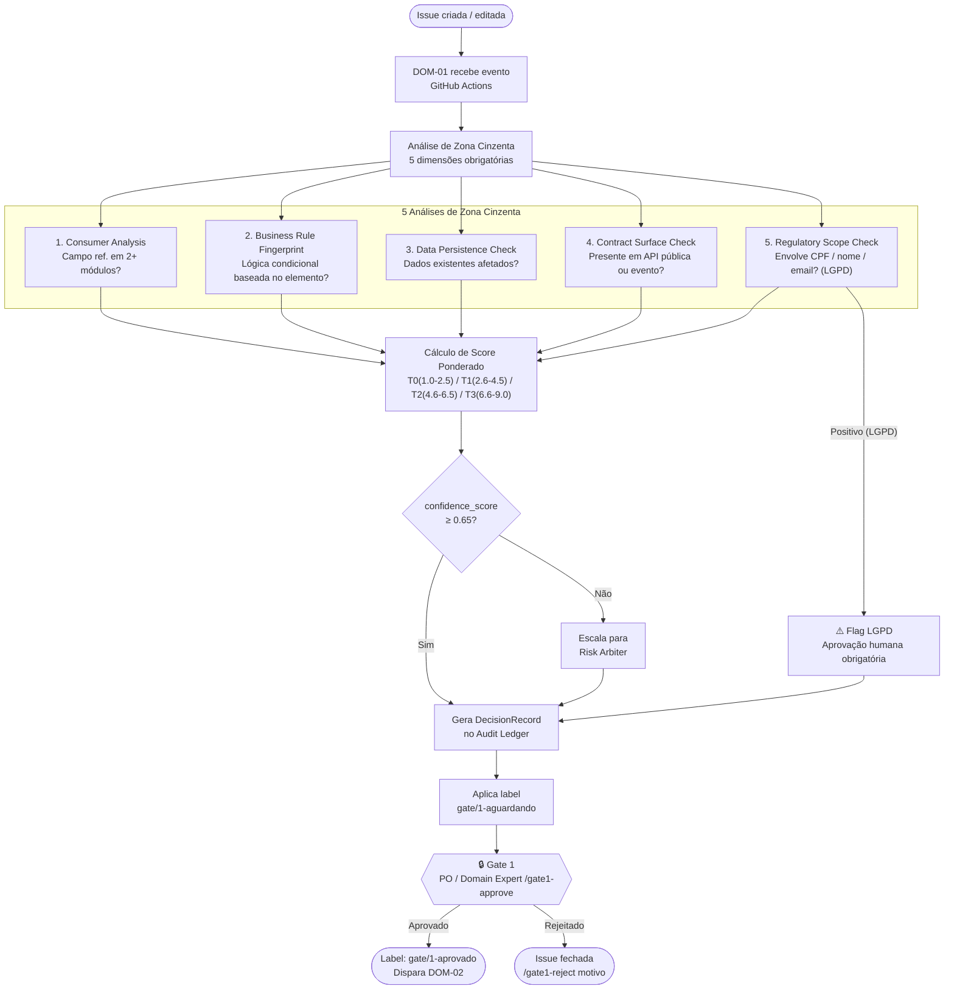

# PROC-001 — Discovery e Classificação de Demanda

## Metadados

| Campo | Valor |
|-------|-------|
| **ID** | PROC-001 |
| **Versão** | 1.0 |
| **Última atualização** | 2026-03-06 |
| **Responsável** | DOM-01 (Discovery Agent) |
| **Trigger** | `issues.opened` / `issues.edited` |

---

## Objetivo

Recepcionar qualquer nova demanda, classificá-la objetivamente em T0..T3 com base em cinco dimensões de risco e registrar o resultado de forma imutável no Audit Ledger, preparando a demanda para aprovação do Gate 1.

---

## Pré-condições

- Issue criada ou editada no repositório GitHub com título e descrição mínimos presentes
- Issue não está marcada como `wontfix` ou `duplicate`

---

## Fluxo Principal

---

## Etapas Detalhadas

| # | Etapa | Responsável | Entrada | Saída | Critério de Aceite |
|---|-------|-------------|---------|-------|---------------------|
| 1 | Recepção do evento | GitHub Actions | Evento `issues.opened` / `.edited` | DOM-01 invocado | Processo iniciado em ≤30s |
| 2 | Consumer Analysis | DOM-01 | Issue + grafo de dependências | Score dimensão 1 | Campo mapeado em todos os módulos |
| 3 | Business Rule Fingerprint | DOM-01 | Issue + RN-01..RN-07 | Score dimensão 2 | Regras afetadas identificadas |
| 4 | Data Persistence Check | DOM-01 | Issue + schema de dados | Score dimensão 3 | Impacto em dados existentes avaliado |
| 5 | Contract Surface Check | DOM-01 | Issue + contratos de API | Score dimensão 4 | APIs e eventos analisados |
| 6 | Regulatory Scope Check | DOM-01 | Issue + campos pessoais | Score dimensão 5 (LGPD) | Flag LGPD definida |
| 7 | Cálculo de score ponderado | DOM-01 | 5 dimensões pontuadas | Score final T0..T3 | Score dentro dos limites definidos |
| 8 | Geração de DecisionRecord | DOM-01 | Score + justificativas | `DecisionRecord` no Audit Ledger | Registro append-only gravado |
| 9 | Aplicação de label | DOM-01 | Classificação T | Label `gate/1-aguardando` | Label visível na issue |
| 10 | Aprovação Gate 1 | PO + Domain Expert | DecisionRecord | `/gate1-approve` na issue | Comentário registrado por aprovador autorizado |

---

## Fluxos Alternativos

| Condição | Desvio | Ação |
|----------|--------|------|
| `confidence_score < 0.65` | Score inconclusivo | Escala automaticamente para Risk Arbiter antes de gerar DecisionRecord |
| Dimensão 5 positiva (LGPD) | Dado pessoal identificado | Flag LGPD adicionada ao DecisionRecord; Gate 1 exige aprovação humana explícita |
| `risk_level == CRITICAL` | Alto risco identificado | Bloqueio imediato + escalada para humano |
| Demanda duplicada detectada | Issue já existe | DecisionRecord aponta para issue original; Gate 1 decide se encerra |
| `/gate1-reject <motivo>` | PO rejeita | Issue fechada com label `wontfix`; motivo registrado |

---

## Regras de Negócio Aplicáveis

- **RN-01..RN-07** devem ser verificadas na dimensão de Business Rule Fingerprint
- Qualquer envolvimento de **dados pessoais** (CPF, nome, e-mail, endereço) ativa flag LGPD
- Score final = Σ (nota_dimensão × peso_dimensão):
  - Complexidade técnica: 25%
  - Impacto negocial: 30%
  - Reversibilidade: 20%
  - Exposição regulatória: 15%
  - Superfície de contrato: 10%

---

## Saídas Obrigatórias

| Artefato | Destino | Classe |
|----------|---------|--------|
| `DecisionRecord` | Audit Ledger | Todas |
| Label `gate/1-aguardando` | GitHub Issue | Todas |
| Flag LGPD (se aplicável) | DecisionRecord | Todas |

---

## Indicadores

| Indicador | Meta |
|-----------|------|
| Tempo de resposta DOM-01 | ≤ 5 min após criação da issue |
| Taxa de escalada ao Risk Arbiter | ≤ 10% |
| Cobertura do Audit Ledger | 100% |
