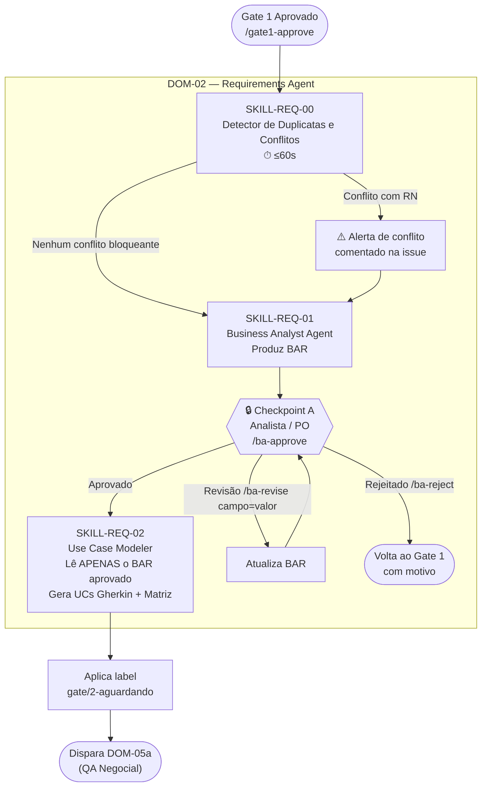

# PROC-002 — Análise de Requisitos

## Metadados

| Campo | Valor |
|-------|-------|
| **ID** | PROC-002 |
| **Versão** | 1.0 |
| **Última atualização** | 2026-03-06 |
| **Responsável** | DOM-02 (Requirements Agent) |
| **Trigger** | `/gate1-approve` comentado na issue |

---

## Objetivo

Transformar a issue aprovada em artefatos de requisitos canônicos (BAR, Use Cases em Gherkin e Matriz de Rastreabilidade), garantindo que toda ambiguidade seja explicitada e que nenhum requisito avance sem aprovação explícita do responsável negocial.

---

## Pré-condições

- Gate 1 aprovado (`gate/1-aprovado` na issue)
- `DecisionRecord` gerado pelo DOM-01 e disponível no Audit Ledger
- Classificação T da demanda definida (T1, T2 ou T3 — T0 pode ter fluxo simplificado)

---

## Fluxo Principal



> ⚠️ **Regra Crítica:** `SKILL-REQ-02` lê **exclusivamente** o BAR aprovado — jamais a issue original.

---

## Etapas Detalhadas

| # | Etapa | Responsável | Entrada | Saída | Critério de Aceite |
|---|-------|-------------|---------|-------|---------------------|
| 1 | Detecção de duplicatas e conflitos | SKILL-REQ-00 (auto) | Issue + RNs existentes + backlog | Relatório de conflitos | Resposta em ≤ 60s; conflitos com RN sinalizados |
| 2 | Produção do BAR | SKILL-REQ-01 | Issue aprovada | BusinessAnalysisRecord | BAR com todos os campos obrigatórios preenchidos |
| 3 | Checkpoint A — Aprovação do BAR | Analista / PO | BAR publicado na issue | `/ba-approve` comentado | Aprovação explícita de aprovador autorizado |
| 4 | Geração de Use Cases + Matriz | SKILL-REQ-02 | BAR aprovado (somente) | UCs em Gherkin + Matriz de Rastreabilidade | Cada UC rastreável ao BAR; Gherkin válido |
| 5 | Aplicação de label | DOM-02 | UCs gerados | Label `gate/2-aguardando` | Label visível na issue; dispara DOM-05a |

---

## Estrutura do BAR (BusinessAnalysisRecord)

| Campo | Obrigatório | Descrição |
|-------|:-----------:|-----------|
| `id` | ✅ | Identificador único (ex: BAR-2026-001) |
| `issue_ref` | ✅ | Referência à issue GitHub |
| `titulo` | ✅ | Título descritivo da demanda |
| `objetivo_negocial` | ✅ | Por que esta demanda existe (perspectiva do negócio) |
| `stakeholders` | ✅ | Quem está envolvido |
| `regras_negocio_afetadas` | ✅ | Lista de RNs (RN-01..RN-07) afetadas |
| `restricoes` | ✅ | Restrições técnicas e negociais |
| `criterios_aceite` | ✅ | Critérios verificáveis de conclusão |
| `escopo_lgpd` | ✅ | Dados pessoais envolvidos (ou ausência) |
| `dependencias` | — | Demandas ou módulos dependentes |
| `riscos` | — | Riscos identificados |

---

## Estrutura dos Use Cases (Gherkin)

```gherkin
Feature: [Nome da funcionalidade — rastreável ao BAR]

  Background:
    Given [pré-condição obrigatória]

  Scenario: [Nome do cenário — ID único]
    Given [contexto inicial]
    When  [ação do ator]
    Then  [resultado esperado verificável]

  Scenario: [Cenário alternativo / exceção]
    Given ...
    When  ...
    Then  ...
```

> **Requisito:** Cada `Scenario` deve ter ID único rastreável na Matriz.

---

## Fluxos Alternativos

| Condição | Desvio | Ação |
|----------|--------|------|
| Conflito com RN detectado pelo SKILL-REQ-00 | Colisão com regra existente | Alerta na issue; Gate 1 / PO decide se prossegue |
| Ambiguidade crítica no BAR | Campo indeterminável | DOM-02 bloqueia e solicita esclarecimento à issue |
| BAR rejeitado no Checkpoint A | `/ba-reject <motivo>` | Demanda volta ao Gate 1 com motivo registrado |
| BAR necessita revisão | `/ba-revise campo=valor` | BAR atualizado e resubmetido ao Checkpoint A |
| Demanda pós-Gate1 detectada como T3 | Reclassificação | `/reclassify-T3` + novo DecisionRecord |

---

## Regras de Negócio Aplicáveis

- SKILL-REQ-02 **jamais** consulta a issue original após Gate 1 — somente o BAR aprovado
- BAR com campo `escopo_lgpd` positivo ativa revisão de Gate 2 obrigatória
- Conflito com RN-01, RN-02 ou RN-03 → alerta de bloqueio automático

---

## Saídas Obrigatórias por Classe

| Artefato | T0 | T1 | T2 | T3 |
|----------|:--:|:--:|:--:|:--:|
| Relatório de Conflitos | — | ✅ | ✅ | ✅ |
| BAR | — | ✅ | ✅ | ✅ |
| Use Cases (Gherkin) | — | ✅ | ✅ | ✅ |
| Matriz de Rastreabilidade | — | — | ✅ | ✅ |

---

## Indicadores

| Indicador | Meta |
|-----------|------|
| Tempo de execução SKILL-REQ-00 | ≤ 60s |
| Taxa de BAR aprovados sem revisão | ≥ 70% |
| Cobertura da Matriz (UCs rastreáveis) | 100% |
