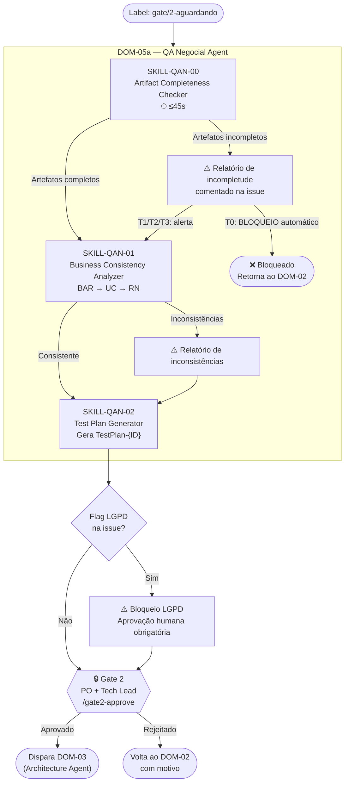

# PROC-003 — QA Negocial (Pré-Gate 2)

## Metadados

| Campo | Valor |
|-------|-------|
| **ID** | PROC-003 |
| **Versão** | 1.0 |
| **Última atualização** | 2026-03-06 |
| **Responsável** | DOM-05a (QA Negocial Agent) |
| **Trigger** | Label `gate/2-aguardando` na issue |

---

## Objetivo

Auditar a completude e consistência dos artefatos de requisitos produzidos pelo DOM-02 **antes** do Gate 2, gerar o `TestPlan-{ID}` que servirá como contrato de entrada obrigatório para o DOM-05b (QA Técnico), e fornecer ao Gate 2 evidências objetivas para a decisão de aprovação.

---

## Pré-condições

- Label `gate/2-aguardando` aplicada à issue
- BAR aprovado no Checkpoint A
- Use Cases em Gherkin publicados na issue
- Matriz de Rastreabilidade gerada (T2/T3)

---

## Fluxo Principal



---

## Etapas Detalhadas

| # | Etapa | Responsável | Entrada | Saída | Critério de Aceite |
|---|-------|-------------|---------|-------|---------------------|
| 1 | Verificação de completude | SKILL-QAN-00 (auto) | UCs + Gherkin + Matriz | Relatório de completude | Resposta em ≤ 45s; schema UC válido |
| 2 | Análise de consistência negocial | SKILL-QAN-01 | BAR + UCs + RN-01..RN-07 | Relatório de consistência | BAR→UC→RN sem contradições |
| 3 | Geração de TestPlan | SKILL-QAN-02 | Artefatos completos e consistentes | `TestPlan-{ID}` | Contrato formal publicado na issue |
| 4 | Aprovação Gate 2 | PO + Tech Lead | Relatórios + TestPlan | `/gate2-approve` | Aprovação explícita de **ambos** os aprovadores |

---

## Estrutura do TestPlan-{ID}

| Seção | Conteúdo |
|-------|----------|
| `id` | Identificador único (ex: TP-2026-001) |
| `issue_ref` | Referência à issue / BAR |
| `cenarios_obrigatorios` | Lista de Scenario IDs do Gherkin |
| `cobertura_minima` | Percentual mínimo de cobertura (padrão: 80%) |
| `rns_verificadas` | RNs que devem ser auditadas no código (para DOM-05b) |
| `dados_lgpd` | Campos com dados pessoais (se aplicável) |
| `criterios_bloqueio` | Condições que causam REQUEST_CHANGES automático |

---

## Regras de Bloqueio

| Condição | T0 | T1 | T2 | T3 |
|----------|:--:|:--:|:--:|:--:|
| Falha crítica de completude (SKILL-QAN-00) | 🚫 BLOQUEIO | ⚠️ Alerta | ⚠️ Alerta | ⚠️ Alerta |
| Falha crítica de consistência (SKILL-QAN-01) | 🚫 BLOQUEIO | ⚠️ Alerta | ⚠️ Alerta | ⚠️ Alerta |
| Flag LGPD ativa | 🚫 BLOQUEIO | 🚫 BLOQUEIO | 🚫 BLOQUEIO | 🚫 BLOQUEIO |
| RN-01, RN-02 ou RN-03 violada | 🚫 BLOQUEIO | 🚫 BLOQUEIO | 🚫 BLOQUEIO | 🚫 BLOQUEIO |

> **LGPD bloqueia em todas as classes sem exceção.**

---

## Fluxos Alternativos

| Condição | Ação |
|----------|------|
| Artefatos incompletos (T0) | Bloqueio automático; DOM-02 deve ser reexecutado |
| Artefatos incompletos (T1/T2/T3) | Alerta na issue; Gate 2 decide se bloqueia ou avança com ressalvas |
| Inconsistência entre BAR e UC | Relatório detalhado; Dom-02 deve corrigir antes do Gate 2 |
| RN não coberta no TestPlan | SKILL-QAN-02 adiciona cenário obrigatório automaticamente |
| Gate 2 rejeitado | Demanda volta ao DOM-02 com motivo registrado |

---

## Elo DOM-05a → DOM-05b

```
DOM-05a especifica → TestPlan-{ID} (o que deve ser testado)
        ↓
DOM-05b verifica → se DOM-04 implementou exatamente o TestPlan

⚠️  SEM TestPlan aprovado → DOM-05b NÃO pode operar
```

O TestPlan é o **contrato formal** que une os dois agentes de QA.

---

## Indicadores

| Indicador | Meta |
|-----------|------|
| Tempo de execução SKILL-QAN-00 | ≤ 45s |
| Cobertura de cenários no TestPlan | 100% dos UCs |
| Taxa de Gate 2 aprovados sem retorno | ≥ 80% |
