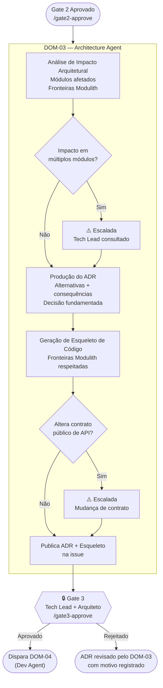

# PROC-004 — Decisão Arquitetural

## Metadados

| Campo | Valor |
|-------|-------|
| **ID** | PROC-004 |
| **Versão** | 1.0 |
| **Última atualização** | 2026-03-06 |
| **Responsável** | DOM-03 (Architecture Agent) |
| **Trigger** | `/gate2-approve` comentado na issue |

---

## Objetivo

Produzir decisões arquiteturais fundamentadas (ADRs) e um esqueleto de código respeitando as fronteiras do Spring Modulith, de forma que o DOM-04 possa implementar com mínima ambiguidade e sem violar contratos de módulo.

---

## Pré-condições

- Gate 2 aprovado por PO **e** Tech Lead
- `TestPlan-{ID}` gerado e aprovado pelo DOM-05a
- BAR + Use Cases aprovados no PROC-002
- ADRs existentes do projeto disponíveis para consulta

---

## Fluxo Principal



---

## Etapas Detalhadas

| # | Etapa | Responsável | Entrada | Saída | Critério de Aceite |
|---|-------|-------------|---------|-------|---------------------|
| 1 | Análise de impacto arquitetural | DOM-03 | UCs + Matriz + TestPlan + ADRs existentes | Lista de módulos afetados | Módulos mapeados; fronteiras Modulith identificadas |
| 2 | Produção do ADR | DOM-03 | Análise de impacto | ADR com alternativas e consequências | ADR seguindo template padrão; pelo menos 2 alternativas avaliadas |
| 3 | Geração de esqueleto de código | DOM-03 | ADR aprovado internamente | Esqueleto + definições de fronteira | Limites de módulo Modulith respeitados |
| 4 | Aprovação Gate 3 | Tech Lead + Arquiteto | ADR + esqueleto | `/gate3-approve` | Aprovação explícita de **ambos** |  

---

## Estrutura do ADR

```markdown
# ADR-{ID}: {Título}

## Status
Proposed | Accepted | Deprecated | Superseded

## Contexto
{Por que esta decisão é necessária?}

## Alternativas Consideradas
| Alternativa | Vantagens | Desvantagens |
|-------------|-----------|-------------|
| A | ... | ... |
| B | ... | ... |

## Decisão
{Qual alternativa foi escolhida e por quê?}

## Consequências
{Impactos positivos e negativos da decisão}

## Módulos Afetados
{Lista de módulos Spring Modulith impactados}

## Referências
{Issue, BAR, UCs, ADRs anteriores}
```

---

## Restrições Arquiteturais (Spring Modulith)

| Restrição | Descrição |
|----------|----------|
| Fronteiras de módulo | Cada módulo expõe apenas APIs públicas definidas; acesso direto a internos é proibido |
| Eventos de domínio | Comunicação entre módulos via eventos (Kafka); nunca por chamada direta |
| Migrations Flyway | Toda migração de schema deve ser sequencial, imutável e nomeada corretamente |
| Testes de arquitetura | `ModulithArchitectureTest` deve passar antes do Gate 4 |

---

## Fluxos Alternativos

| Condição | Ação |
|----------|------|
| Impacto em múltiplos módulos | Escalada ao Tech Lead antes de produzir ADR |
| Mudança de contrato público de API | Escalada obrigatória + nota no ADR |
| Gate 3 rejeitado | DOM-03 revisa ADR com base no motivo; novo ciclo de Gate 3 |
| ADR em conflito com ADR anterior | Marcar ADR anterior como `Superseded`; referenciar na seção de contexto |

---

## Saídas Obrigatórias por Classe

| Artefato | T0 | T1 | T2 | T3 |
|----------|:--:|:--:|:--:|:--:|
| Análise de impacto | — | — | ✅ | ✅ |
| ADR | — | — | ✅ | ✅ |
| Esqueleto de código | — | — | ✅ | ✅ |
| Gate 3 (TL + Arq.) | — | — | ✅ | ✅ |

---

## Indicadores

| Indicador | Meta |
|-----------|------|
| Número de ADRs com 2+ alternativas avaliadas | 100% |
| Taxa de Gate 3 aprovados sem revisão | ≥ 75% |
| Violações de fronteira Modulith detectadas no Gate 4 | 0 |
