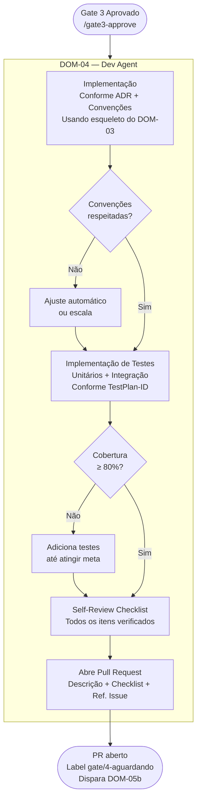

# PROC-005 — Implementação

## Metadados

| Campo | Valor |
|-------|-------|
| **ID** | PROC-005 |
| **Versão** | 1.0 |
| **Última atualização** | 2026-03-06 |
| **Responsável** | DOM-04 (Dev Agent) |
| **Trigger** | `/gate3-approve` comentado na issue |

---

## Objetivo

Implementar o código conforme as decisões arquiteturais (ADR), as convenções do projeto e os cenários do TestPlan, abrindo um PR pronto para revisão técnica pelo DOM-05b.

---

## Pré-condições

- Gate 3 aprovado por Tech Lead **e** Arquiteto
- ADR publicado e aceito
- Esqueleto de código disponibilizado pelo DOM-03
- `TestPlan-{ID}` disponibilizado pelo DOM-05a

---

## Fluxo Principal



---

## Etapas Detalhadas

| # | Etapa | Responsável | Entrada | Saída | Critério de Aceite |
|---|-------|-------------|---------|-------|---------------------|
| 1 | Implementação conforme ADR | DOM-04 | ADR + esqueleto + UCs | Código implementado | Convenções `SKILL-convencoes.md` respeitadas |
| 2 | Testes unitários | DOM-04 | TestPlan-{ID} (cenários unitários) | Testes `.java` implementados | Cobertura ≥ 80% no escopo da feature |
| 3 | Testes de integração | DOM-04 | TestPlan-{ID} (cenários de integração) | Testes de integração implementados | Todos os cenários Gherkin cobertos |
| 4 | Self-review checklist | DOM-04 | Código + testes | Checklist preenchido | Todos os itens verificados (sem item em branco) |
| 5 | Abertura de PR | DOM-04 | Código completo | PR no GitHub | PR com descrição, checklist e referência à issue |

---

## Self-Review Checklist (DOM-04)

```markdown
## Checklist DOM-04

### Código
- [ ] Implementação segue o ADR aprovado
- [ ] Fronteiras de módulo Modulith respeitadas (sem acesso direto a internos)
- [ ] Nenhuma dependência cíclica entre módulos
- [ ] Migrations Flyway sequenciais e imutáveis
- [ ] Convenções de nomenclatura aplicadas

### Regras de Negócio
- [ ] RNs afetadas implementadas corretamente (conforme TestPlan)
- [ ] Saldo nunca negativo sem cheque especial explícito (RN-01)
- [ ] Transferências com dois lançamentos atômicos (RN-02)
- [ ] Transação CONFIRMADA não excluída, apenas estornada (RN-03)

### Testes
- [ ] Cobertura ≥ 80% no escopo da feature
- [ ] Todos os cenários do TestPlan-{ID} cobertos
- [ ] Testes não dependem de ordem de execução

### Segurança (OWASP)
- [ ] Nenhuma informação sensível em logs
- [ ] SQL Queries parametrizadas (sem concatenação)
- [ ] Dados pessoais protegidos conforme LGPD
```

---

## Convenções Obrigatórias

DOM-04 deve seguir `SKILL-convencoes.md` (Java, Spring Modulith, Python, GitHub Actions), incluindo:

| Categoria | Convenção |
|-----------|----------|
| Módulos | Cada módulo tem pacote próprio isolado |
| APIs | Apenas interfaces públicas expostas entre módulos |
| Eventos | Comunicação intes-módulos exclusivamente via eventos de domínio |
| Persistence | Uma entidade por agregado; repositório por módulo |
| Migrations | `V{n}__{descricao}.sql` sequencial e nunca alterado após push |
| Testes | Unitários isolados (sem I/O); integração com TestContainers |

---

## Fluxos Alternativos

| Condição | Ação |
|----------|------|
| Impossibilidade técnica de implementar conforme ADR | Escalada obrigatória ao Tech Lead antes de prosseguir |
| Cobertura abaixo de 80% | DOM-04 adiciona testes antes de abrir PR |
| Violação de fronteira Modulith detectada | DOM-04 corrige antes de abrir PR |
| PR recebe `REQUEST_CHANGES` do DOM-05b | DOM-04 corrige os pontos apontados e sincroniza o PR |

---

## Indicadores

| Indicador | Meta |
|-----------|------|
| Cobertura de testes no PR | ≥ 80% |
| Taxa de PR aprovados sem REQUEST_CHANGES | ≥ 70% |
| Violações de Modulith no PR | 0 |
| Items vazios no checklist | 0 |
