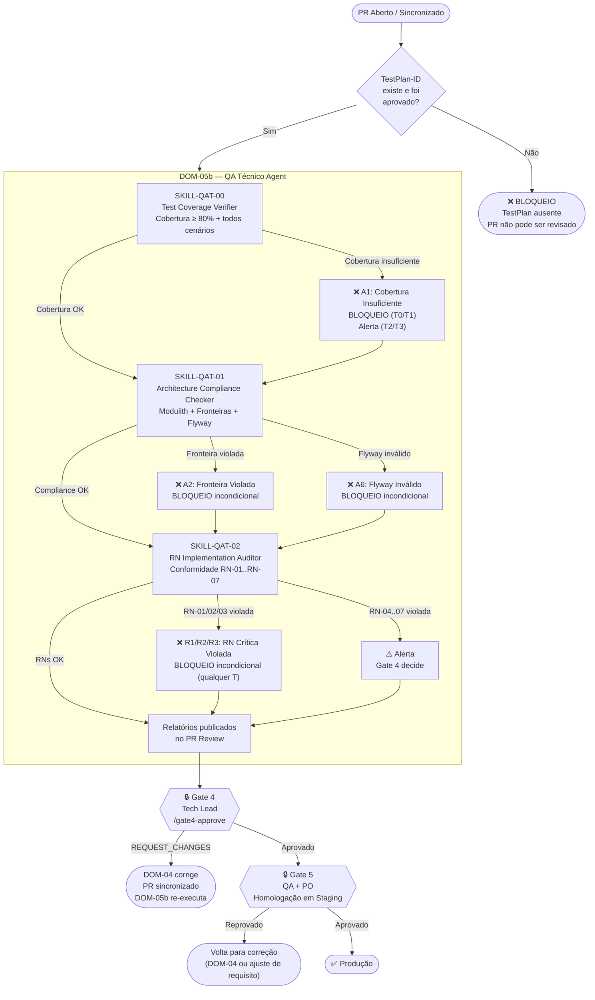

# PROC-006 — QA Técnico (Pré-Gate 4)

## Metadados

| Campo | Valor |
|-------|-------|
| **ID** | PROC-006 |
| **Versão** | 1.0 |
| **Última atualização** | 2026-03-06 |
| **Responsável** | DOM-05b (QA Técnico Agent) |
| **Trigger** | `pull_request.opened` / `pull_request.synchronize` |

---

## Objetivo

Auditar o PR do DOM-04 contra o `TestPlan-{ID}` (cobertura de testes), as restrições arquiteturais do Spring Modulith (fronteiras e Flyway) e as regras negociais (RN-01..RN-07), fornecendo ao Gate 4 e Gate 5 evidências objetivas de qualidade técnica.

---

## Pré-condições

- Pull Request aberto pelo DOM-04
- `TestPlan-{ID}` aprovado pelo DOM-05a (entrada obrigatória)
- ADR publicado e Gate 3 aprovado

> **⚠️ Sem `TestPlan-{ID}` aprovado → DOM-05b não pode operar.**

---

## Fluxo Principal

---

## Etapas Detalhadas

| # | Etapa | Responsável | Entrada | Saída | Critério de Aceite |
|---|-------|-------------|---------|-------|---------------------|
| 1 | Verificação de cobertura | SKILL-QAT-00 | PR + TestPlan-{ID} | Relatório de cobertura | ≥ 80% + todos os cenários do TestPlan presentes |
| 2 | Compliance arquitetural | SKILL-QAT-01 | PR + ADR | Relatório Modulith + Flyway | Fronteiras respeitadas + migrations válidas |
| 3 | Auditoria de RNs no código | SKILL-QAT-02 | PR + RN-01..RN-07 | Relatório de conformidade | RNs implementadas corretamente |
| 4 | Aprovação Gate 4 | Tech Lead | Relatórios DOM-05b | `/gate4-approve` | Aprovação com base nos relatórios |
| 5 | Homologação Gate 5 | QA + PO | Build em staging | Aceite funcional | Funcionalidades conforme UCs aprovados |

---

## Códigos de Bloqueio

| Código | Descrição | Classe de bloqueio |
|--------|-----------|-------------------|
| **A1** | Cobertura de testes insuficiente (< 80%) | T0/T1: `REQUEST_CHANGES` auto; T2/T3: alerta |
| **A2** | Fronteira de módulo Modulith violada | **Incondicional** (todos os T) |
| **A6** | Migration Flyway inválida ou fora de ordem | **Incondicional** (todos os T) |
| **R1** | Violação de RN-01 (saldo negativo) | **Incondicional** (todos os T) |
| **R2** | Violação de RN-02 (atomicidade transferência) | **Incondicional** (todos os T) |
| **R3** | Violação de RN-03 (exclusão de CONFIRMADA) | **Incondicional** (todos os T) |

> Bloqueios **incondicionais** não podem ser ignorados pelo Gate 4. O PR deve ser corrigido.

---

## Fluxos Alternativos

| Condição | Ação |
|----------|------|
| TestPlan-{ID} ausente | BLOQUEIO imediato; DOM-05a deve ser reexecutado |
| PR sincronizado após correções | DOM-05b re-executa todas as skills |
| Violação de RN-01/02/03 | `REQUEST_CHANGES` automático sem aguardar Gate 4 |
| Violação de RN-04..07 | Alerta; Gate 4 decide se bloqueia ou aceita com ressalva |
| Gate 5 reprovado em staging | Demanda retorna ao DOM-04 se defeito técnico, ou ao DOM-02 se desvio de requisito |

---

## Indicadores

| Indicador | Meta |
|-----------|------|
| Taxa de PRs aprovados no Gate 4 sem re-execução | ≥ 70% |
| Violações incondicionais (A2, A6, R1, R2, R3) chegando ao Gate 4 | 0 |
| Cobertura mínima de testes nos PRs aprovados | 100% ≥ 80% |
| Taxa de aprovação no Gate 5 (homologação) | ≥ 90% |
