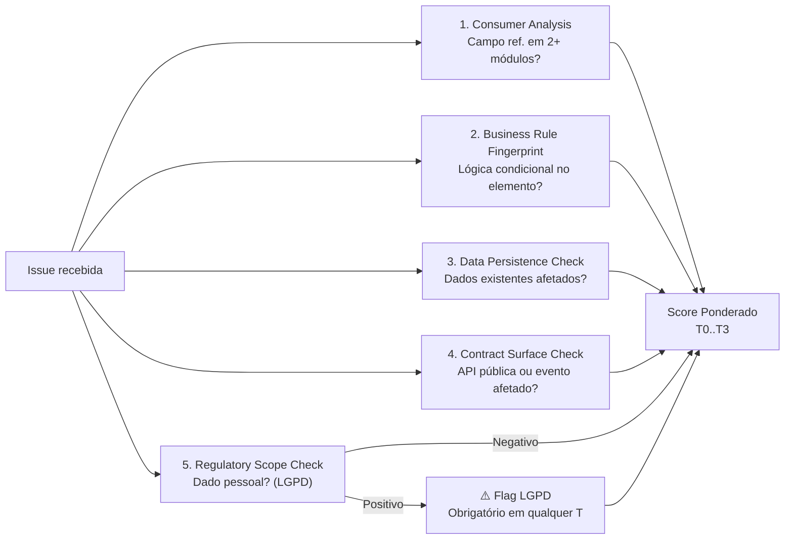

# PROC-007 — Modelo de Classificação de Impacto (T0→T3)

## Metadados

| Campo | Valor |
|-------|-------|
| **ID** | PROC-007 |
| **Versão** | 1.0 |
| **Última atualização** | 2026-03-06 |
| **Responsável** | DOM-01 (Discovery Agent) / PO / Tech Lead |

---

## Objetivo

Descrever o modelo de classificação de risco utilizado pela fábrica para determinar o nível de autonomia dos agentes, a quantidade de gates obrigatórios e a intensidade da supervisão humana em cada demanda.

---

## Classes de Impacto

```mermaid
quadrantChart
    title Classificação de Impacto vs Autonomia dos Agentes
    x-axis Baixo Risco --> Alto Risco
    y-axis Baixa Autonomia --> Alta Autonomia
    quadrant-1 Totalmente Assistido (T3)
    quadrant-2 Multi-Gate (T2)
    quadrant-3 Semi-Autônomo (T1)
    quadrant-4 Totalmente Autônomo (T0)
    T0: [0.20, 0.85]
    T1: [0.40, 0.60]
    T2: [0.65, 0.35]
    T3: [0.85, 0.15]
```

| Classe | Score | Autonomia | Pipeline |
|--------|-------|-----------|----------|
| **T0** | 1.0 – 2.5 | Totalmente autônomo | Agente implementa → staging → aprovação funcional → prod |
| **T1** | 2.6 – 4.5 | Semi-autônomo | Gates: QA Review + Validação funcional |
| **T2** | 4.6 – 6.5 | Multi-gate | 5 gates obrigatórios |
| **T3** | 6.6 – 9.0 | Totalmente assistido | Zero autonomia — agentes como aceleradores |  

---

## Fórmula de Score

$$\text{Score} = \sum_{i=1}^{5} (\text{nota}_i \times \text{peso}_i)$$

| # | Dimensão | Peso | Descrição |
|---|----------|:----:|-----------|
| 1 | Complexidade técnica | 25% | Módulos, integrações, camadas afetadas |
| 2 | Impacto negocial | 30% | Toca RNs? Afeta fluxo financeiro? Altera contratos? |
| 3 | Reversibilidade | 20% | Rollback simples (T0) vs. irreversível com dados reais (T3) |
| 4 | Exposição regulatória | 15% | Dados pessoais, LGPD, compliance |
| 5 | Superfície de contrato | 10% | APIs públicas, eventos de domínio, integrações externas |

---

## 5 Análises de Zona Cinzenta (DOM-01)

Resultado positivo em qualquer análise **eleva** a classificação para o próximo nível.



| # | Análise | Gatilho de Elevação |
|---|---------|---------------------|
| 1 | Consumer Analysis | Campo referenciado em 2+ módulos distintos |
| 2 | Business Rule Fingerprint | Lógica condicional diretamente baseada no elemento alterado |
| 3 | Data Persistence Check | Dados existentes em produção seriam afetados pela mudança |
| 4 | Contract Surface Check | Elemento presente em contrato de API pública ou evento de domínio |
| 5 | Regulatory Scope Check | Envolve dado pessoal identificável (CPF, nome, e-mail, endereço) |

---

## Restrições por Classe

### T0 — Totalmente Autônomo
- Agentes implementam, testam e promovem para staging sem aprovação prévia
- Gate final: aprovação humana **funcional** (não técnica) antes de produção
- DOM-05a falha crítica → **BLOQUEIO automático**
- DOM-05b falha crítica → **REQUEST_CHANGES automático**

### T1 — Semi-Autônomo
- Gates obrigatórios: QA Review + Validação funcional
- DOM-05a falha crítica → alerta, Gate 2 decide
- DOM-05b falha crítica → REQUEST_CHANGES automático

### T2 — Multi-Gate
- **5 gates obrigatórios** — nenhum pode ser pulado
- Cada gate tem responsável humano definido
- DOM-05a/05b produzem relatórios para auxiliar decisão humana

### T3 — Totalmente Assistido
- **Zero etapas autônomas**
- Agentes leem, analisam, resumem e sugerem — toda decisão é humana
- Use case típico: mudanças em RNs críticas, reestruturação de domínios, compliance

---

## Regras de Reclassificação

| Comando | Ação | Aprovers |
|---------|------|----------|
| `/reclassify-T0` | Rebaixa para T0 | PO (sozinho) + justificativa |
| `/reclassify-T1` | Reclassifica para T1 | PO + Tech Lead |
| `/reclassify-T2` | Eleva para T2 | PO + Tech Lead |
| `/reclassify-T3` | Eleva para T3 (máxima assistência) | PO + Tech Lead |

> Reclassificação **sempre** gera novo `DecisionRecord` no Audit Ledger.
> Não é possível reclassificar demanda que já passou do Gate 2 sem reabrir o fluxo.

---

## Guia Rápido de Classificação

| Cenário | Classificação |
|---------|---------------|
| Ajuste de texto em mensagem de erro | T0 |
| Novo campo opcional em DTO sem lógica | T0 – T1 |
| Nova regra de validação em módulo isolado | T1 |
| Novo endpoint que agrega dados de 2+ módulos | T1 – T2 |
| Mudança em cálculo de orçamento (toca RN-04) | T2 |
| Mudança na lógica de saldo (toca RN-01 ou RN-02) | T2 (mínimo) |
| Refatoração de módulo com migration Flyway em produção | T2 – T3 |
| Alteração de RN crítica ou reestruturação de domínio | T3 |
| Qualquer mudança envolvendo dados pessoais (LGPD) | T2+ com gate obrigatório |
