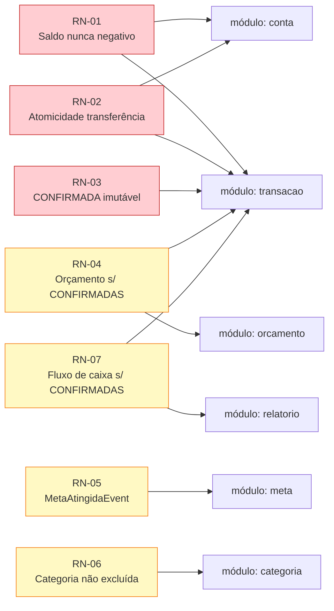
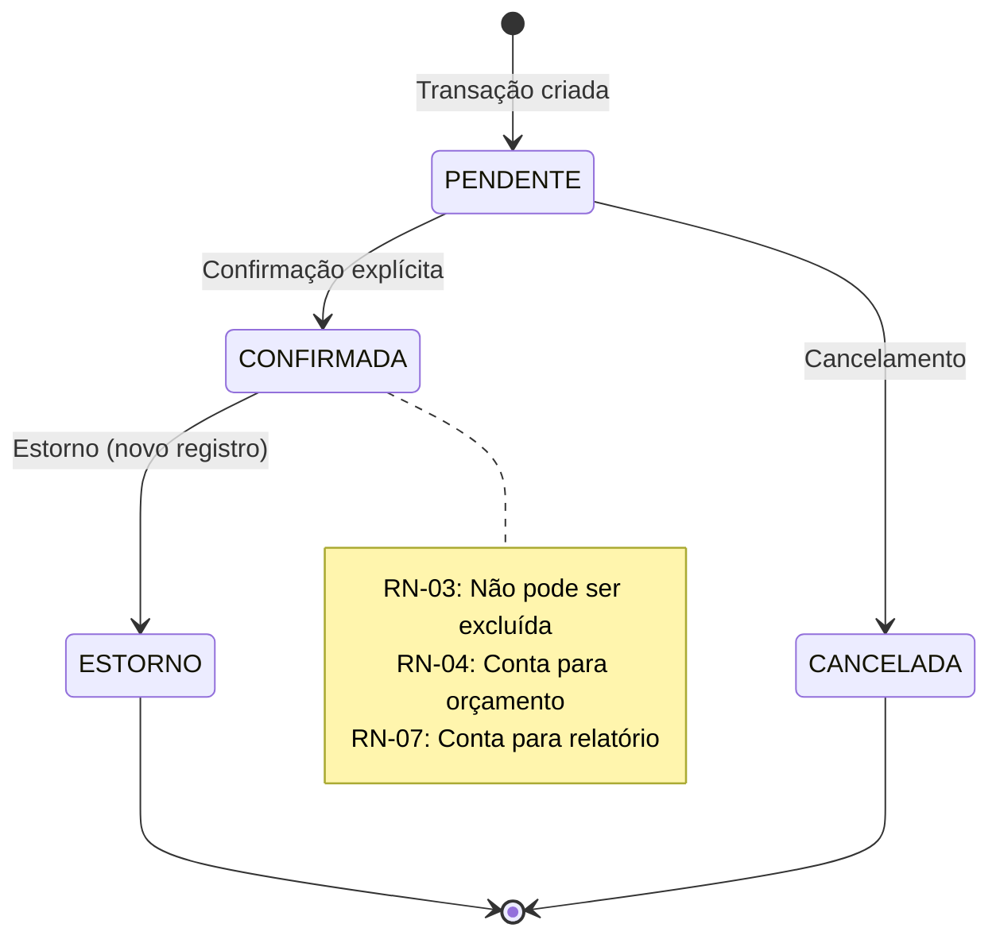
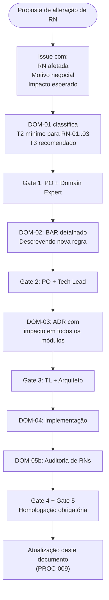

# PROC-009 — Regras Negociais (RN-01..RN-07)

## Metadados

| Campo | Valor |
|-------|-------|
| **ID** | PROC-009 |
| **Versão** | 1.0 |
| **Última atualização** | 2026-03-06 |
| **Responsável** | PO + Tech Lead |
| **Domínio** | `deep-ion` — fintech-pessoal |

---

## Objetivo

Documentar as regras de negócio imutáveis do domínio `deep-ion`, que governam o comportamento do sistema de gestão financeira pessoal. Toda alteração nessas regras exige classificação mínima T2, e violações de RN-01, RN-02 e RN-03 causam **bloqueio automático** em qualquer classe.

---

## RN-01..RN-07 — Regras Imutáveis

| ID | Regra | Impacto mínimo | Bloqueio automático |
|----|-------|:--------------:|:-------------------:|
| **RN-01** | Saldo nunca negativo sem limite de cheque especial explicitamente definido | T2 | ✅ Sim |
| **RN-02** | Transferência gera dois lançamentos atômicos (débito + crédito) | T2 | ✅ Sim |
| **RN-03** | Transação `CONFIRMADA` não pode ser excluída — apenas estornada | T2 | ✅ Sim |
| RN-04 | Orçamento calculado exclusivamente sobre DESPESAS CONFIRMADAS no período | T1 | ❌ Não |
| RN-05 | Meta atingida dispara evento de domínio `MetaAtingidaEvent` | T1 | ❌ Não |
| RN-06 | Categorias padrão não podem ser exluídas — apenas desativadas | T1 | ❌ Não |
| RN-07 | Relatório de fluxo de caixa considera apenas transações `CONFIRMADAS` | T1 | ❌ Não |

---

## Mapeamento RN → Módulo



> Módulos em vermelho: críticos — qualquer alteração deve ser revisada com máxima atenção.

---

## Estados de Transação



| Transição proibida | Motivo |
|--------------------|---------|
| `CONFIRMADA` → `EXCLUÍDA` | RN-03: usa estorno como novo registro |
| `CONFIRMADA` → `PENDENTE` | Imutabilidade de estado confirmado |
| `CANCELADA` → `CONFIRMADA` | Irreversibilidade do cancelamento |

---

## Impacto de RN-01 (Saldo Nunca Negativo)

```
Verificação obrigatória antes de qualquer débito:

  saldo_atual - valor_debito >= 0
  OU
  limite_cheque_especial > 0 AND saldo_atual - valor_debito >= -limite_cheque_especial

Se nenhuma condição satisfeita → operação REJEITADA
```

---

## Impacto de RN-02 (Atomicidade de Transferência)

```
Transferência entre contas A → B:

  [1] Lançamento DÉBITO em conta A (valor negativo)
  [2] Lançamento CRÉDITO em conta B (valor positivo)

  Ambos devem ser persistidos na MESMA transação de banco.
  Falha em qualquer um → rollback completo de ambos.
```

---

## Checklist de Conformidade (Auditoria DOM-05b)

Antes de aprovar qualquer PR que toque módulos financeiros, verificar:

- [ ] Nenhuma operação de débito sem verificação de saldo (RN-01)
- [ ] Transferências usam transação atômica com dois lançamentos (RN-02)
- [ ] Nenhum `DELETE` em transações `CONFIRMADAS` (RN-03)
- [ ] Orçamentos filtram apenas `status = CONFIRMADA` (RN-04)
- [ ] Evento `MetaAtingidaEvent` disparado ao atingir meta (RN-05)
- [ ] Categorias padrão desativadas, não excluídas (RN-06)
- [ ] Relatórios filtram apenas `status = CONFIRMADA` (RN-07)

---

## Processo de Alteração de RN

> Toda proposta de alteração de RN deve seguir o pipeline completo T2 ou T3.


